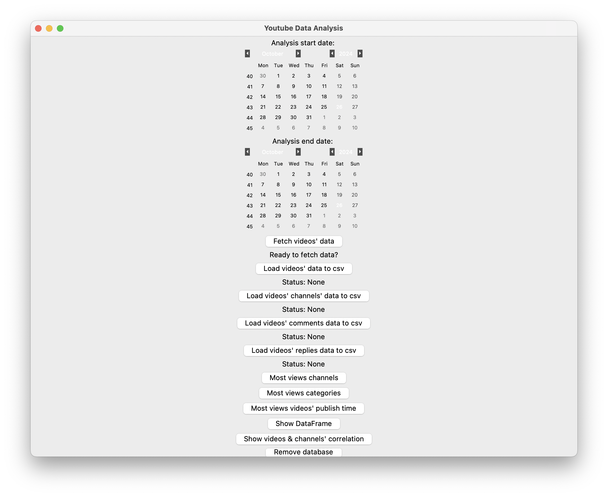
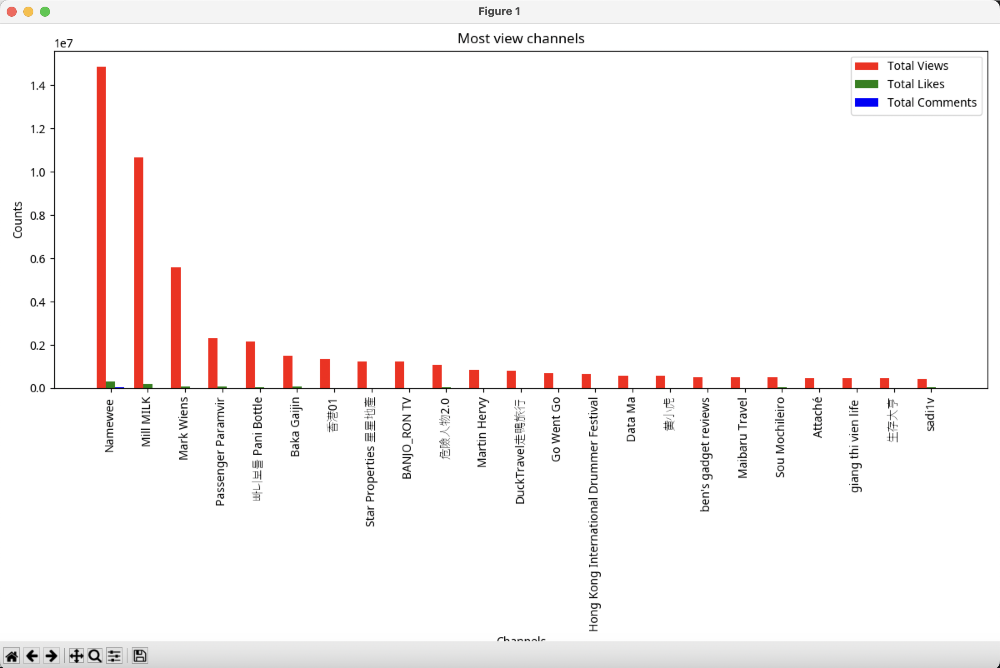

# YoutubeDataAnalysis


# Table of contents
1. [About](#-about)
2. [Output](#-output)
3. [How to Build](#-how-to-build)
4. [Contact](#-contact)

# 📚 About
Have you ever wanted to be a youtuber? Are you interested in Hong Kong Youtube Market? This Youtube data analysis projects helps! By simply choosing the time period you're interested in the graphical user interface, you could get interesting insights from it!

# 💡 Output
## Graphical User Interface (GUI)


## Sample Output


# How to Build
## Workflow


### 1. Create database and table
```python
# Create database and table
from googleapiclient.discovery import build
from datetime import datetime
import pyodbc
import json
import os
from dotenv import load_dotenv

def create_table():
    conn = pyodbc.connect(connection_string)
    cursor = conn.cursor()
    cursor.execute('''IF OBJECT_ID('Search_list_table', 'U') IS NULL
                   BEGIN 
                   CREATE TABLE Search_list_table(
                data_collected_date NVARCHAR(20) NOT NULL,
                video_id NVARCHAR(50) NOT NULL,
                video_title NVARCHAR(255) NOT NULL,
                publish_time DATETIME NOT NULL,
                publish_month_day NVARCHAR(50) NOT NULL,
                publish_month INT NOT NULL,
                publish_day INT NOT NULL,
                publish_after DATETIME NOT NULL,
                publish_before DATETIME NOT NULL,
                channel_id NVARCHAR(50) NOT NULL,
                channel_title NVARCHAR(50) NOT NULL,
                video_description NVARCHAR(4000) NOT NULL,
                video_thumbnails NVARCHAR(4000) NOT NULL,
                liveBroadcastContent NVARCHAR(50),
                view_count INT,
                like_count INT,
                comment_count INT,
                video_length NVARCHAR(255) NOT NULL,
                video_category_id NVARCHAR(255) NOT NULL,
                video_category_name NVARCHAR(255) NOT NULL,
                video_default_language NVARCHAR(20),
                video_tags NVARCHAR(4000),
                video_made_For_Kids BIT
                )
                END''')
    conn.commit()
    conn.close()
```
### 2. Retrieve variables needed using load_env
```python
api_key = os.getenv("api_key")
server = os.getenv("server")
database = os.getenv("database")
username = os.getenv("username")
password = os.getenv("password")
driver = os.getenv("driver")

connection_string = f'DRIVER={driver};SERVER=tcp:{server};PORT=1433;DATABASE={database};UID={username};PWD={password};CHARSET=UTF8;'
```

### 3. API call & Insert data into database
```python
# Create a resource object to interact with google specific API
youtube = build('youtube', 'v3', developerKey = api_key)

'''Function to get most view videos in 2024
   three methods needed to acquire comprehensive videos' stats'''

# Initializing empty lists to store retrieved data
all_video_basic_data = []
all_video_detail_data = []
all_video_category_id_name_data_list_of_dict = []

def fetch_most_views_videos_stats(youtube, publish_after, publish_before):
    # print("Fetching data...")
    request = youtube.search().list(
        part = "id, snippet",
        channelType="any",
        location="22.381581, 114.133992", # centre location of hong kong
        locationRadius="37km", # it setted as the farthest distance from hong kong's centre, which would cover all videos uploaded in Hong Kong
        maxResults=50,
        order="viewCount",
        publishedAfter=f"{publish_after}",
        publishedBefore=f"{publish_before}",
        type="video"
    )
    response = request.execute()
```
```python
''' fetch video's basic_data '''
    all_video_id = []
    for i in range(len(response["items"])):
        publish_time_value = response["items"][i]["snippet"]["publishTime"]
        publish_time = datetime.strptime(publish_time_value, "%Y-%m-%dT%H:%M:%SZ")
        publish_month_day = datetime.strftime(publish_time, "%m-%d")
        publish_month = int(publish_time.month)
        publish_day = int(publish_time.day)
        data_collected_time = datetime.now()
        data_collected_date = data_collected_time.strftime("%Y-%m-%d")
        thumbnails_str = json.dumps(response["items"][i]["snippet"]["thumbnails"])

        basic_data = dict(data_collected_date = data_collected_date,
                    video_id = response["items"][i]["id"]["videoId"],
                    video_title = response["items"][i]["snippet"]["title"],
                    publish_date = response["items"][i]["snippet"]["publishedAt"],
                    publish_time = response["items"][i]["snippet"]["publishTime"],
                    publish_month_day = publish_month_day,
                    publish_month = publish_month,
                    publish_day = publish_day,
                    publish_after = publish_after,
                    publish_before = publish_before,
                    channel_id = response["items"][i]["snippet"]["channelId"],
                    channel_title = response["items"][i]["snippet"]["channelTitle"],
                    video_description = response["items"][i]["snippet"]["description"],
                    video_thumbnails = thumbnails_str,
                    liveBroadcastContent = response["items"][i]["snippet"]["liveBroadcastContent"]
                    )
        all_video_basic_data.append(basic_data)
        all_video_id.append(basic_data["video_id"])

    str_all_video_id = ','.join(all_video_id)
```

```python
''' fetch video's detail_data '''
    request_video_details = youtube.videos().list(
        part = "snippet, contentDetails, status, statistics",
        id = f"{str_all_video_id}"
    )

    response_video_details = request_video_details.execute()
    # save_response_to_file(response_video_details)
    
    for i in range(len(response_video_details["items"])):
        tags_str = json.dumps(response_video_details["items"][i]["snippet"].get("tags", None))
        detail_data = dict(view_count = response_video_details["items"][i]["statistics"]["viewCount"],
                             like_count = response_video_details["items"][i]["statistics"]["likeCount"],
                             comment_count = response_video_details["items"][i]["statistics"].get("commentCount", None),
                             video_length = response_video_details["items"][i]["contentDetails"]["duration"],
                             video_category_id = response_video_details["items"][i]["snippet"]["categoryId"],
                             video_default_language = response_video_details["items"][i]["snippet"].get("defaultLanguage", None),
                             video_tags = tags_str,
                             video_made_For_Kids = response_video_details["items"][i]["status"].get("madeForKids", None)
                             )
        all_video_detail_data.append(detail_data)
```
```python
'''fetch video's category data'''
    request_video_category = youtube.videoCategories().list(
        part = "snippet",
        regionCode = "HK"
    )

    response_video_category = request_video_category.execute()

    for i in range(len(response_video_category["items"])):
        category_detail_dict = dict(video_category_id = response_video_category["items"][i]["id"],
                               video_category_name = response_video_category["items"][i]["snippet"]["title"]
                            )
        all_video_category_id_name_data_list_of_dict.append(category_detail_dict)
```
```python
'''Merge video_data together'''
all_video_category_id_name_data_dict = {}
    for category_id_name_dict in all_video_category_id_name_data_list_of_dict:
        video_category_id = category_id_name_dict["video_category_id"]
        video_category_name = category_id_name_dict["video_category_name"]
        all_video_category_id_name_data_dict[video_category_id] = video_category_name

    print(len(all_video_basic_data))
    print(len(all_video_detail_data))
    print(len(all_video_category_id_name_data_list_of_dict))

    if len(all_video_basic_data) != len(all_video_detail_data):
        raise ValueError("Lists must be the same length to merge completely")
    
    merged_data_list = []
    for basic_data, detail_data in zip(all_video_basic_data, all_video_detail_data):
        video_category_id = str(detail_data["video_category_id"])
        video_category_name = all_video_category_id_name_data_dict.get(video_category_id, "Unknown")
        merged_data = {**basic_data, **detail_data, "video_category_name" : video_category_name} 
        merged_data_list.append(merged_data)

    create_table()

    for merged_data_detail in merged_data_list:
        most_views_data = {
            "data_collected_date" : merged_data_detail["data_collected_date"],
            "video_id" : merged_data_detail["video_id"],
            "video_title" : merged_data_detail["video_title"],
            "publish_time" : merged_data_detail["publish_time"],
            "publish_month_day" : merged_data_detail["publish_month_day"],
            "publish_month" : merged_data_detail["publish_month"],
            "publish_day" : merged_data_detail["publish_day"],
            "publish_after" : merged_data_detail["publish_after"],
            "publish_before" : merged_data_detail["publish_before"],
            "channel_id" : merged_data_detail["channel_id"],
            "channel_title" : merged_data_detail["channel_title"],
            "video_description" : merged_data_detail["video_description"],
            "video_thumbnails" : merged_data_detail["video_thumbnails"],
            "liveBroadcastContent" : merged_data_detail["liveBroadcastContent"],
            "view_count" : merged_data_detail["view_count"],
            "like_count" : merged_data_detail["like_count"],
            "comment_count" : merged_data_detail["comment_count"],
            "video_length" : merged_data_detail["video_length"],
            "video_category_id" : str(merged_data_detail["video_category_id"]),
            "video_category_name" : merged_data_detail["video_category_name"],
            "video_default_language" : merged_data_detail["video_default_language"],
            "video_tags" : merged_data_detail["video_tags"],
            "video_made_For_Kids" : 1 if merged_data_detail["video_made_For_Kids"] else 0
        }

        conn = pyodbc.connect(connection_string)
        cursor = conn.cursor()
        cursor.execute('''INSERT INTO Search_list_table 
                    (data_collected_date, video_id, video_title, publish_time, publish_month_day, publish_month, publish_day, publish_after, publish_before, channel_id, channel_title, video_description, video_thumbnails, liveBroadcastContent, view_count, like_count, comment_count, video_length, video_category_id, video_category_name, video_default_language, video_tags, video_made_For_Kids) 
                    VALUES (?, ?, ?, ?, ?, ?, ?, ?, ?, ?, ?, ?, ?, ?, ?, ?, ?, ?, ?, ?, ?, ?, ?) ''', 
                    (most_views_data["data_collected_date"], most_views_data["video_id"], most_views_data["video_title"], most_views_data["publish_time"], most_views_data["publish_month_day"], most_views_data["publish_month"], most_views_data["publish_day"], most_views_data["publish_after"], most_views_data["publish_before"], most_views_data["channel_id"], most_views_data["channel_title"], most_views_data["video_description"], most_views_data["video_thumbnails"], most_views_data["liveBroadcastContent"], most_views_data["view_count"], most_views_data["like_count"], most_views_data["comment_count"], most_views_data["video_length"], most_views_data["video_category_id"], most_views_data["video_category_name"], most_views_data["video_default_language"], most_views_data["video_tags"], most_views_data["video_made_For_Kids"]))
        conn.commit()
        conn.close()

    return merged_data_list
```
### 4. Configuration about font display
```python
# Register each font path
font_paths = [
    '/Users/hickeychan/Desktop/Noto_Sans,Noto_Sans_JP,Noto_Sans_KR,Noto_Sans_SC,Noto_Sans_TC/Noto_Sans/NotoSans-VariableFont_wdth,wght.ttf',
    '/Users/hickeychan/Desktop/Noto_Sans,Noto_Sans_JP,Noto_Sans_KR,Noto_Sans_SC,Noto_Sans_TC/Noto_Sans_JP/NotoSansJP-VariableFont_wght.ttf',
    '/Users/hickeychan/Desktop/Noto_Sans,Noto_Sans_JP,Noto_Sans_KR,Noto_Sans_SC,Noto_Sans_TC/Noto_Sans_KR/NotoSansKR-VariableFont_wght.ttf',
    '/Users/hickeychan/Desktop/Noto_Sans,Noto_Sans_JP,Noto_Sans_KR,Noto_Sans_SC,Noto_Sans_TC/Noto_Sans_SC/NotoSansSC-VariableFont_wght.ttf',
    '/Users/hickeychan/Desktop/Noto_Sans,Noto_Sans_JP,Noto_Sans_KR,Noto_Sans_SC,Noto_Sans_TC/Noto_Sans_TC/NotoSansTC-VariableFont_wght.ttf'
]

for path in font_paths:
    fm.fontManager.addfont(path)

# Refresh the font cache to include newly added fonts
fm._load_fontmanager(try_read_cache=False)  # Load the font manager without cache

# Set font properties globally for matplotlib
plt.rcParams["font.family"] = ["Noto Sans", "Noto Sans JP", "Noto Sans KR", "Noto Sans SC", "Noto Sans TC"]
```
### 5. Define functions in GUI
```python
'''Define functions in GUI'''
def fetch_data():
    publish_after = calendar_start_date.get_date()
    publish_before = calendar_end_date.get_date()
    publish_after_iso = datetime.strptime(publish_after, "%m/%d/%Y").strftime("%Y-%m-%dT%H:%M:%SZ")
    publish_before_iso = datetime.strptime(publish_before, "%m/%d/%Y").strftime("%Y-%m-%dT%H:%M:%SZ")

    print(f"Fetching data from {publish_after_iso} to {publish_before_iso}")

    fetch_most_views_videos_stats(youtube, publish_after_iso, publish_before_iso)

def most_views_channels():
    server = os.getenv("server")
    database = os.getenv("database")
    username = os.getenv("username")
    password = os.getenv("password")
    driver = os.getenv("driver")

    connection_string = f'DRIVER={driver};SERVER=tcp:{server};PORT=1433;DATABASE={database};UID={username};PWD={password};CHARSET=UTF8;'
    conn = pyodbc.connect(connection_string)

    publish_after = calendar_start_date.get_date()
    publish_before = calendar_end_date.get_date()

    query = '''SELECT channel_title, SUM(view_count) AS total_view_count, SUM(like_count) AS total_like_count, SUM(comment_count) AS total_comment_count
               FROM [dbo].[Search_list_table]
               WHERE data_collected_date = FORMAT(GETDATE(), 'yyyy-MM-dd') AND publish_time BETWEEN ? AND ?
               GROUP BY channel_id, channel_title
               ORDER BY total_view_count DESC'''
    df = pd.read_sql_query(query, conn, params = [publish_after, publish_before])
    conn.close()

    bar_width = 0.25
    bar_view_position = range(len(df["channel_title"]))
    bar_like_position = [x + bar_width for x in bar_view_position]
    bar_comment_position = [x + bar_width for x in bar_like_position]

    plt.figure(figsize = (12, 8))
    plt.bar(bar_view_position, df["total_view_count"], width = bar_width, color = "r", label = "Total Views")
    plt.bar(bar_like_position, df["total_like_count"], width = bar_width, color = "g", label = "Total Likes")
    plt.bar(bar_comment_position, df["total_comment_count"], width = bar_width, color = "b", label = "Total Comments")
    plt.title("Most view channels")
    plt.xlabel("Channels")
    plt.ylabel("Counts")
    plt.xticks([x + bar_width for x in range(len(df["channel_title"]))], df["channel_title"], rotation = 90)
    plt.legend()
    plt.tight_layout()
    plt.show()

def most_views_categories():
    server = os.getenv("server")
    database = os.getenv("database")
    username = os.getenv("username")
    password = os.getenv("password")
    driver = os.getenv("driver")

    connection_string = f'DRIVER={driver};SERVER=tcp:{server};PORT=1433;DATABASE={database};UID={username};PWD={password};CHARSET=UTF8;'
    conn = pyodbc.connect(connection_string)

    publish_after = calendar_start_date.get_date()
    publish_before = calendar_end_date.get_date()

    query = '''SELECT video_category_name, SUM(view_count) AS total_view_count, COUNT(video_id) AS total_number_of_video, SUM(view_count)/COUNT(video_id) AS number_of_audience_per_video
               FROM [dbo].[Search_list_table]
               WHERE data_collected_date = FORMAT(GETDATE(), 'yyyy-MM-dd') AND publish_time BETWEEN ? AND ?
               GROUP BY video_category_name
               ORDER BY number_of_audience_per_video DESC'''
    
    df = pd.read_sql_query(query, conn, params = [publish_after, publish_before])
    conn.close()

    plt.figure(figsize = (12, 8))
    plt.bar(df["video_category_name"], df["number_of_audience_per_video"], color = ["red", "green", "blue", "orange", "purple", "black", "yellow"])
    plt.xlabel("Category")
    plt.ylabel("Audience per video")
    plt.title("Most views categories")
    plt.tight_layout()
    plt.show()

def most_views_publish_time():
    server = os.getenv("server")
    database = os.getenv("database")
    username = os.getenv("username")
    password = os.getenv("password")
    driver = os.getenv("driver")

    connection_string = f'DRIVER={driver};SERVER=tcp:{server};PORT=1433;DATABASE={database};UID={username};PWD={password};CHARSET=UTF8;'
    conn = pyodbc.connect(connection_string)

    publish_after = calendar_start_date.get_date()
    publish_before = calendar_end_date.get_date()

    query = '''SELECT * FROM [dbo].[Search_list_table]
               WHERE data_collected_date = FORMAT(GETDATE(), 'yyyy-MM-dd') AND publish_time BETWEEN ? AND ?'''
    
    df = pd.read_sql_query(query, conn, params = [publish_after, publish_before])
    df["publish_time"] = pd.to_datetime(df["publish_time"], format = "%Y-%m-%dT%H:%M:%SZ")
    df["publish_hour"] = df["publish_time"].dt.hour
    hourly_counts = df.groupby(by="publish_hour")["view_count"].sum().reset_index(name = 'total_view_count')

    plt.figure(figsize = (12, 8))
    plt.bar(hourly_counts["publish_hour"], hourly_counts["total_view_count"])
    plt.xlabel("Hour")
    plt.ylabel("Total views")
    plt.xticks(list(range(24)))
    plt.title("Most views videos' publish hour")
    plt.tight_layout()
    plt.show()
```
### 6. GUI
```python
# Create interface with tkinter
root = tk.Tk()
root.title("Youtube Data Analysis")
root.geometry("1000x1000")

Analysis_start_date_label = tk.Label(root, text = "Analysis start date: ")
Analysis_end_date_label = tk.Label(root, text = "Analysis end date: ")
calendar_start_date = Calendar(root, selectmode = "day", date_pattern = "mm/dd/yyyy")
calendar_end_date = Calendar(root, selectmode = "day", date_pattern = "mm/dd/yyyy")
fetch_button = tk.Button(root, text = "Fetch data", command=fetch_data)
most_views_channels_button = tk.Button(root, text = "Most views channels", command=most_views_channels)
most_views_categories_button = tk.Button(root, text = "Most views categories", command=most_views_categories)
most_views_publish_time_button = tk.Button(root, text = "Most views videos' publish time", command=most_views_publish_time)

# Pack elements in GUI
Analysis_start_date_label.pack()
calendar_start_date.pack()
Analysis_end_date_label.pack()
calendar_end_date.pack()
fetch_button.pack()
most_views_channels_button.pack()
most_views_categories_button.pack()
most_views_publish_time_button.pack()

root.mainloop()
```

# 📧 Contact
If you're interested in my project, please feel free to contact me through email, my email is kevincyhei@gmail.com.
